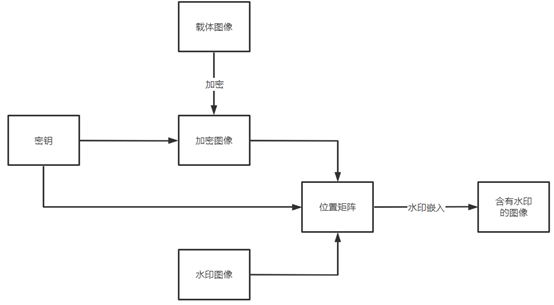
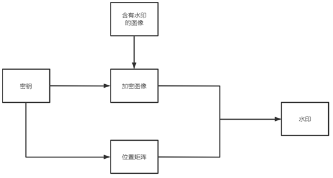
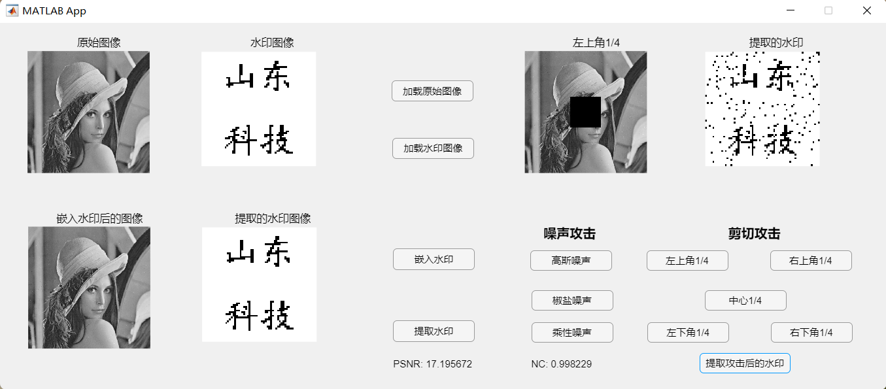
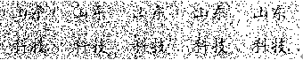
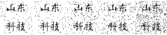
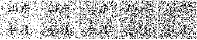
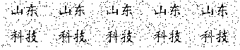

# 一种基于加密域的数字图像水印算法的设计与实现

## 项目介绍

本科毕业设计，算法使用`matlab`实现，`matlab`版本`R2021a`

算法流程：首先，对读入的载体图像进行加密，在加密的图像上，进行水印的嵌入和提取，嵌入位置根据随机生成的位置矩阵来选择，嵌入的位平面为随机选择4到6位进行嵌入。

加密算法采用了混沌和置乱相结合的方式，首先使用混沌加密，再对混沌加密后的图像，进行随机行列置乱。

水印嵌入算法流程图



水印提取算法流程图



## 项目结构

```bash
|-   embedded_position_analysis.mlx --------- 水印嵌入位置分析
|-   encryption_algorithm.mlx --------------- 加密算法实现
|-   encryption_algorithm_analysis.mlx ------ 加密算法分析
|-   generate_watermark_image.m ------------- 水印图像生成
|-   LICENSE -------------------------------- MIT LICENSE
|-   nc.m ----------------------------------- 计算归一化相关系数
|-   psnr.m --------------------------------- 计算峰值信噪比
|-   README.md ------------------------------ README.md
|-   watermarkApp.mlapp --------------------- 图形化界面
|-   watermark_algorithm.mlx ---------------- 水印算法的实现与性能分析
```

## 效果展示



## 性能分析

### JPEG压缩

|          |           |           |          |           |           |
| :------: | :-------: | :-------: | :------: | :-------: | :-------: |
| 压缩系数 |    90     |    80     |    70    |    60     |    50     |
|   PSNR   | 39.910863 | 37.641087 | 36.55191 | 35.767086 | 35.178293 |
|    NC    | 0.992581  | 0.983114  | 0.978859 | 0.976929  | 0.973907  |

### 均值滤波

|       |      |          |          |          |
| :---: | :--: | :------: | :------: | :------: |
| hsize | 1x1  |   2x2    |   3x3    |   4x4    |
|  NC   |  1   | 0.976746 | 0.969216 | 0.964832 |

### 高斯噪声

|      |          |          |          |          |          |
| :--: | :------: | :------: | :------: | :------: | :------: |
| 方差 |  0.001   |  0.0007  |  0.0005  |  0.0003  |  0.0001  |
|  NC  | 0.991362 | 0.992097 | 0.991693 | 0.995232 | 0.995085 |

             

### 椒盐噪声

|          |          |          |          |          |          |
| :------: | :------: | :------: | :------: | :------: | :------: |
| 噪声密度 |   0.05   |   0.07   |   0.09   |   0.1    |   0.2    |
|    NC    | 0.998648 | 0.999181 | 0.997661 | 0.998335 | 0.995282 |



### 乘性噪声

|      |          |          |          |          |          |
| :--: | :------: | :------: | :------: | :------: | :------: |
| 方差 |  0.001   |  0.003   |  0.005   |  0.007   |  0.009   |
|  NC  | 0.994953 | 0.990981 | 0.987029 | 0.984932 | 0.982234 |



### 图像剪切

|          |           |           |          |           |           |
| :------: | :-------: | :-------: | :------: | :-------: | :-------: |
| 剪切位置 | 左上角1/4 | 右上角1/4 | 中心1/4  | 左下角1/4 | 右下角1/4 |
|    NC    | 0.999322  | 0.998776  | 0.998229 | 0.998918  | 0.998504  |




### 图像旋转

|          |          |          |         |          |          |
| :------: | :------: | :------: | :-----: | :------: | :------: |
| 旋转度数 |    1     |    3     |    5    |    7     |    9     |
|    NC    | 0.983129 | 0.982764 | 0.98323 | 0.983012 | 0.982354 |

## 总结

本文结合混沌系统和图像置乱技术提出了一种基于混沌和置乱的图像加密算法，并将该算法应用到数字水印技术中，实现了一种基于加密域的数字图像水印算法。水印算法使用二值图像作为水印，水印的嵌入在图像的加密域进行，具有较好的安全性，水印提取不需要原始未加水印的图像，是一种盲水印算法。实验表明，该水印算法嵌入的水印不可见性好，对图像剪切、添加噪声等攻击具有较好的鲁棒性。

## 参考文献

[1]Kaushik H. Raviya,DwivediVed Vyas,Ashish M. Kothari. Image Watermarking – Hybrid Approach for Embedding Binary Watermark into the Digital Image[J]. International Journal of Recent Technology and Engineering (IJRTE),2020,9(4).

[2] Eskicioglu A.M., Delp E.J.. An Overview of Multimedia Content Protection in Consumer Electronics Devices[J]. Signal Processing:Image Communication, 2001,16(7): 681-699

[3]Jianting Guo,Peijia Zheng,Jiwu Huang. Secure watermarking scheme against watermark attacks in the encrypted domain[J]. Journal of Visual Communication and Image Representation,2015,30.

[4]梅时春,李人厚,刘芳,党红梅.一种加密域数字图像水印方法[J].计算机工程与设计,2004(02):216-219.DOI:10.16208/j.issn1000-7024.2004.02.017.

[5]茅耀斌. 基于混沌的图像加密与数字水印技术研究[D].南京理工大学,2003.

[6]贾淑芸,黄荣怀,温孝东,叶卫平.基于置乱和混沌加密的数字图像水印技术研究[J].北京师范大学学报(自然科学版),2005(02):146-149.

[7]杨阳,李欣然,胡锦川.基于块重构的加密域可逆信息隐藏[J].应用科学学报,2021,39(06):906-922.

[8]张敏情,周能,刘蒙蒙,柯彦.同态加密域可逆信息隐藏技术研究[J].信息网络安全,2020,20(08):25-36.

[9]马广瑶,黄德璐,王建军.基于预测误差编码的加密域可逆数据隐藏算法[J].计算机工程,2021,47(05):138-143+153.DOI:10.19678/j.issn.1000-3428.0057500.

[10]毕洪波. 鲁棒性数字图像与视频水印算法研究[D].北京邮电大学,2013.

[11]周亚训,叶庆卫,徐铁峰.基于二值运算的数字图像水印嵌入与检测算法[J].计算机辅助设计与图形学学报,2002(02):148-152.

[12]刘九芬,黄达人,黄继武.图像水印抗几何攻击研究综述[J].电子与信息学报,2004(09):1495-1503.

[13]耿海亭. 加密域可逆图像水印算法研究[D].曲阜师范大学,2017.
