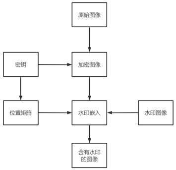
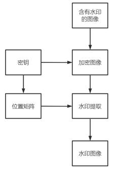
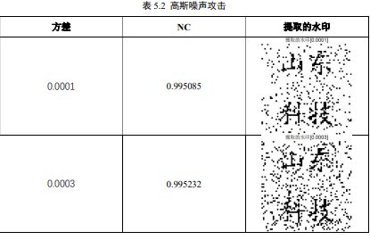
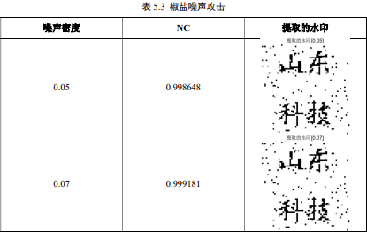
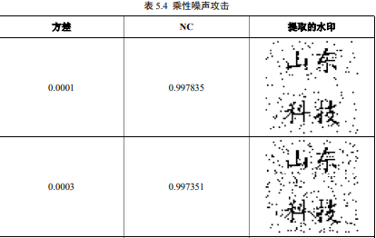
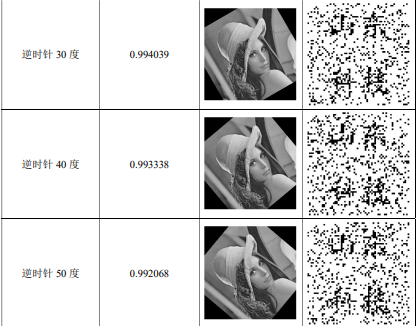
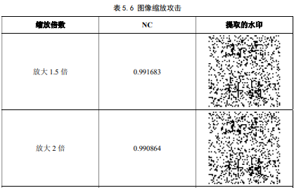
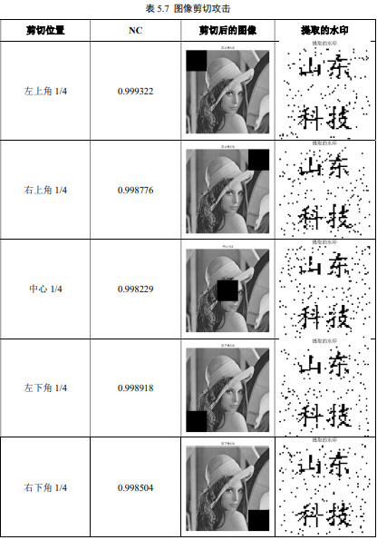

# 一种基于加密域的数字图像水印算法的设计与实现

## 项目介绍

本科毕业设计

题目：一种基于加密域的数字图像水印算法的设计与实现

随着数字媒体技术的发展，数字媒体版权的保护得到了越来越多人的重视，数字水印技术作为数字媒体版权保护的有效手段，得到了快速发展。数字水印技术将水印信息嵌入到多媒体作品中，既保证了多媒体作品的质量需求，又能够对多媒体作品进行版权保护。

本文结合混沌系统和图像置乱技术提出了一种基于混沌和置乱的图像加密算法，并将该算法应用到数字水印技术中，实现了一种基于加密域的数字图像水印算法。水印系统对于输入的载体图像，首先，根据密钥对图像进行混沌加密，然后再进行置乱加密，利用密钥生成随机位置矩阵来确定水印的嵌入位置，具体嵌入位置为随机选择3到5位，水印算法使用二值图像作为水印，水印的嵌入和提取都是在图像的加密域进行，具有较好的安全性。水印提取时需要根据密钥来生成位置矩阵，并对嵌入水印后的图像进行加密处理，根据位置矩阵选择水印像素的位置，从对应位置提取出水印的像素值，在水印提取的过程中不需要原始图像和水印图像，该水印算法是一种盲水印算法。本文对实现的基于加密域的水印算法进行了性能测试实验，对于一些常见的水印攻击方式进行了实验，主要测试了水印算法对于高斯噪声、椒盐噪声、乘性噪声、图像旋转攻击、图像缩放攻击、图像剪切攻击的鲁棒性。实验结果表明，该水印算法嵌入的水印不可见性好，对图像剪切、添加噪声等攻击方式具有较好的鲁棒性。

水印嵌入流程图

水印提取流程图

## 效果展示

## 性能测试

高斯噪声攻击

椒盐噪声攻击

乘性噪声攻击

图像旋转攻击

图像缩放攻击

图像剪切攻击

## 总结

随着人们对版权意识的不断提高，在未来几年内，数字媒体作品的版权保护也会得到越来越多的重视。数字水印技术是解决数字产品版权保护问题的有效手段之一，尽管数字水印技术在这几年里有了快速的发展，但它仍然有许多问题有待解决。由于信息社会中信息安全和数字水印版权保护的必要性，在某些领域，基于加密域的数字图像水印算法得到了极大的发展。比如说，在一些对于安全性要求较高的领域，任何微小的安全问题都会导致整个系统的崩溃，从而影响到整个全局战略。而基于加密域的数字图像水印算法结合了加密算法和水印算法的优点，在近几年内得到了快速发展。

本文对基于加密域的数字图像水印算法进行了研究，结合国内外研究现状和参考文献，探讨了基于加密域的数字水印算法，主要完成了以下工作：

(1) 对一些图像加密算法进行了研究和复现，对不同加密算法的性能进行了仿真实验。本文重点研究了基于混沌和置乱的图像加密方式，在Logistic混沌序列加密算法的基础上，结合了图像置乱算法，提出了一种基于混沌和置乱的图像加密算法，并通过Matlab对该算法的性能进行了仿真实验，实验结果表明，改进后的算法抵抗图像剪切攻击的能力得到了明显的提高。

(2) 使用Matlab实现了一种基于加密域的数字图像水印算法，该算法利用了前面提到的加密算法，并对实现的水印算法进行了噪声攻击、剪切攻击等实验，实验结果表明该算法具有较好的不可见性和鲁棒性。

(3) 在该水印算法的基础上，设计并实现了方便用户进行操作的GUI，用户可以通过该图形化界面轻松地实现水印的嵌入和提取。

在论文的撰写和研究中，尽管查阅并翻译了许多文献，并认真学习了数字水印的基本理论和相关技术。但随着研究的不断深入，发现仍然有一些问题需要进行解决。由于时间和个人水平有限，本文还存在一些不足：

(1) 加密算法直接对整个图像进行了加密操作，没有对图像进行分块处理，对于图像分块数量、大小等影响加密算法性能的因素没有细致的考虑，加密算法存在较大的优化空间。

(2) 水印算法的鲁棒性有待提高，本文中设计的水印算法在进行水印嵌入的时候直接修改了对应的像素位，这种方式虽然能够提高水印的嵌入量，但也会导致水印算法对于一些攻击的鲁棒性下降。

## 参考文献

[1]梅时春,李人厚,刘芳,党红梅.一种加密域数字图像水印方法[J].计算机工程与设计,2004(02):216-219.DOI:10.16208/j.issn1000-7024.2004.02.017.

[2]耿海亭. 加密域可逆图像水印算法研究[D].曲阜师范大学,2017.

[3]Kaushik H. Raviya,DwivediVed Vyas,Ashish M. Kothari. Image Watermarking – Hybrid Approach for Embedding Binary Watermark into the Digital Image[J]. International Journal of Recent Technology and Engineering (IJRTE),2020,9(4).

[4]Jianting Guo,Peijia Zheng,Jiwu Huang. Secure watermarking scheme against watermark attacks in the encrypted domain[J]. Journal of Visual Communication and Image Representation,2015,30.

[5]茅耀斌. 基于混沌的图像加密与数字水印技术研究[D].南京理工大学,2003.

[6]贾淑芸,黄荣怀,温孝东,叶卫平.基于置乱和混沌加密的数字图像水印技术研究[J].北京师范大学学报(自然科学版),2005(02):146-149.

[7]杨阳,李欣然,胡锦川.基于块重构的加密域可逆信息隐藏[J].应用科学学报,2021,39(06):906-922.

[8]张敏情,周能,刘蒙蒙,柯彦.同态加密域可逆信息隐藏技术研究[J].信息网络安全,2020,20(08):25-36.

[9]马广瑶,黄德璐,王建军.基于预测误差编码的加密域可逆数据隐藏算法[J].计算机工程,2021,47(05):138-143+153.DOI:10.19678/j.issn.1000-3428.0057500.

[10]毕洪波. 鲁棒性数字图像与视频水印算法研究[D].北京邮电大学,2013.

[11]周亚训,叶庆卫,徐铁峰.基于二值运算的数字图像水印嵌入与检测算法[J].计算机辅助设计与图形学学报,2002(02):148-152.

[12]刘九芬,黄达人,黄继武.图像水印抗几何攻击研究综述[J].电子与信息学报,2004(09):1495-1503.

[13]孙超. 基于DWT-SVD的数字图像盲水印算法研究[D].华南理工大学,2012.

[14] Eskicioglu A.M., Delp E.J.. An Overview of Multimedia Content Protection in Consumer Electronics Devices[J]. Signal Processing:Image Communication, 2001,16(7): 681-699
